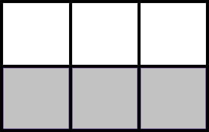
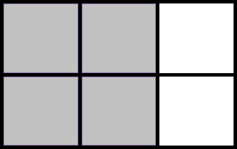

# Experiment with CSS Grid Layout

[](http://hemersonvianna.mit-license.org/)
[](https://github.com/experiment-solutions/experiment-css-grid-layout/issues)

## Translations

* [Portuguese - Brazil](translations/pt_BR)

## Browser Support

- Chrome 29+(Enabling flag)
- Firefox 40+(Enabling flag)
- Opera 28+(Enabling flag)
- IE 10+

Only IE 10+ and Edge support Grid Layout. It can be enabled in Chrome through the `Experimental Web Platform features` flag in `chrome://flags`. You can enable it in Firefox using the `layout.css.grid.enabled` flag.

## Terminology

### Grid Container

The element on which `display: grid` is applied. It's the direct parent of all the grid items.

```html
<div class="grid-container">
  <div class="grid-item item-1"></div>
  <div class="grid-item item-2"></div>
</div>
```

```css
.grid-container { display: grid; }
```

### Grid Item

Direct children of the `grid container`. Here the `grid-item` elements are grid items, but `grid-subitem` isn't.

```html
<div class="grid-container">
  <div class="grid-item item-1">
    <div class="grid-subitem"></div>
  </div>
  <div class="grid-item item-2"></div>
</div>
```

### Grid Line

The dividing lines that make up the structure of the grid. They can be either vertical (column grid lines) or horizontal (row grid lines) and reside on either side of a row or column. 


### Grid Track

The space between two adjacent grid lines. You can think of them like the columns or rows of the grid. Here's the grid track between the second and third row grid lines.



### Grid Cell

The space between two adjacent row and two adjacent column grid lines. It's a single **unit** of the grid. Here's the grid cell between row grid lines 1 and 2, and column grid lines 2 and 3.


### Grid Area

The total space surrounded by four grid lines. A grid area may be comprised of any number of grid cells. Here's the grid area between row grid lines 1 and 3, and column grid lines 1 and 3.



## Properties

### Properties for the Grid Container

- display
  - grid 
  - inline-grid
- grid-template-columns
- grid-template-rows
- grid-template-areas
- grid-column-gap
- grid-row-gap
- grid-gap
- justify-items
- align-items
- justify-content
- align-content
- grid-auto-columns
- grid-auto-rows
- grid-auto-flow
- grid

### Properties for the Grid Items

- grid-column-start
- grid-column-end
- grid-row-start
- grid-row-end
- grid-column
- grid-row
- grid-area
- justify-self
- align-self

## Contributing

- Fork it!
- Create your feature branch: `git checkout -b my-new-feature`
- Commit your changes: `git commit -m 'Add some feature'`
- Push to the branch: `git push origin my-new-feature`
- Submit a pull request

## Log

Check [Releases](https://github.com/experiment-solutions/experiment-css-grid-layout/releases) for detailed changelog.

## License

[MIT license](http://hemersonvianna.mit-license.org/) © Hemerson Vianna
